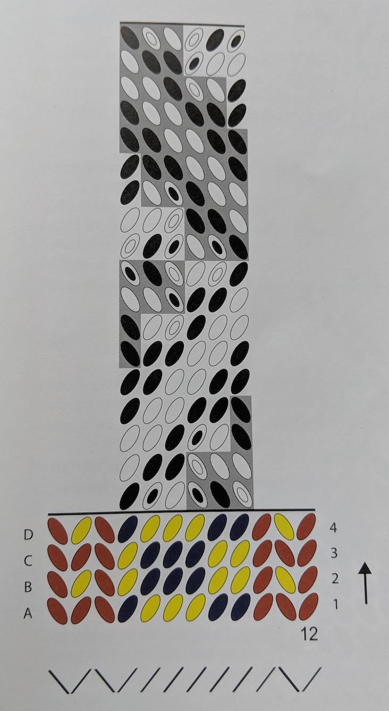

# App for designing and sharing tablet weaving patterns

Tablet weaving is a handicraft technique that produces 1 to 5 cm wide ribbons, that can be used belts, straps and other forms of decorating clothes. The technique is historical, it dates back to early Iron Age in Europe. Modern day weavers do tablet weaving because it is easy to set up and learn, and it takes little space. You can read more about tablet weaving e.g. [on Wikipedia](https://en.wikipedia.org/wiki/Tablet_weaving).

Traditionally patterns for tablet weaving have been designed by pencil and paper. However, designing patterns is a process that has many repetitive and logical tasks, which could be easily automated. Therefore I developed this tablet weaving app, so that weavers could save their time and energy when designing new patterns.

The pattern marking notations and instructions differ from country to country. This app uses a notation that is developed by two Finnish tablet weavers, Maikki Karisto and Mervi Pasanen (which they introduce in their book Applesies and Fox Noses: Finnish Tabletwoven Bands, Salakirjat, 2013).

Below is an image of the pattern notation. This pattern is called "Reversed Corners":

## Goals and state of development
I started this project with the goal of making a Minimal Viable Product of a tablet weaving app for myself and my friends. (A personal goal was also to keep React framework active on my mind when e.g. at work I am using some other framework.)

If you'd like to contribute to this project, all merge requests welcome!
Below is a list of features that I have come up with and plan to implement for this project. Completed ones are marked with [x]. The order is roughly prioritized.

### List of features
A user should be able to:
- [x] change the direction of a single model stitch, and then all stitches after that stitch change direction too
- [x] double click a stitch, and then the stitch becomes a double stitch, or, if the st was a double already, becomes a normal stitch
- [x] change the color of the master stitch
- [x] change the direction of a master column
- [x] see the latest used colors
- change one color for another color (and all stitches in the color will change to the new color)
- save a pattern
- open a latest saved pattern
- print out a pattern
- see a longer version (many repeats) of the current pattern
- add more edge columns (while designing, so that the previously typed pattern doesn't go empty)
- add more center columns
- add more model rows
- continue working with the app even if their internet connection is lost (offline-first)
- add more warp yarns/tablet holes

This project was bootstrapped with [Create React App](https://github.com/facebook/create-react-app).

## Available Scripts

In the project directory, you can run:

### `npm start`

Runs the app in the development mode. 
Open [http://localhost:3000](http://localhost:3000) to view it in the browser.

The page will reload if you make edits. 
You will also see any lint errors in the console.

### `npm test`

Launches the test runner in the interactive watch mode. 
See the section about [running tests](https://facebook.github.io/create-react-app/docs/running-tests) for more information.

### `npm run build`

Builds the app for production to the `build` folder. 
It correctly bundles React in production mode and optimizes the build for the best performance.

The build is minified and the filenames include the hashes. 
Your app is ready to be deployed!

See the section about [deployment](https://facebook.github.io/create-react-app/docs/deployment) for more information.

### `npm run eject`

**Note: this is a one-way operation. Once you `eject`, you can’t go back!**

If you aren’t satisfied with the build tool and configuration choices, you can `eject` at any time. This command will remove the single build dependency from your project.

Instead, it will copy all the configuration files and the transitive dependencies (Webpack, Babel, ESLint, etc) right into your project so you have full control over them. All of the commands except `eject` will still work, but they will point to the copied scripts so you can tweak them. At this point you’re on your own.

You don’t have to ever use `eject`. The curated feature set is suitable for small and middle deployments, and you shouldn’t feel obligated to use this feature. However we understand that this tool wouldn’t be useful if you couldn’t customize it when you are ready for it.

## Learn More

You can learn more in the [Create React App documentation](https://facebook.github.io/create-react-app/docs/getting-started).

To learn React, check out the [React documentation](https://reactjs.org/).

### Code Splitting

This section has moved here: https://facebook.github.io/create-react-app/docs/code-splitting

### Analyzing the Bundle Size

This section has moved here: https://facebook.github.io/create-react-app/docs/analyzing-the-bundle-size

### Making a Progressive Web App

This section has moved here: https://facebook.github.io/create-react-app/docs/making-a-progressive-web-app

### Advanced Configuration

This section has moved here: https://facebook.github.io/create-react-app/docs/advanced-configuration

### Deployment

This section has moved here: https://facebook.github.io/create-react-app/docs/deployment

### `npm run build` fails to minify

This section has moved here: https://facebook.github.io/create-react-app/docs/troubleshooting#npm-run-build-fails-to-minify
